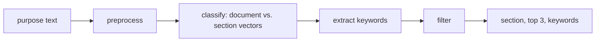

# Zero-Shot NACE Classification of German Trade Register Texts

[](https://github.com/dilaydikbiyik/keyword-extractor/actions/workflows/ci.yml)
[](LICENSE)
[](https://www.python.org/downloads/)

**[Read the research record →](https://dilaydikbiyik.github.io/keyword-extractor/)**
One page: every claim this project made and what became of it — a retracted
headline, two of its own hypotheses falsified, and three label-free studies whose
predictions were committed before they were measured, 12 of 15 of which held.

Assigning **NACE Rev. 2** economic sections to German company purpose
statements with no labelled training data, by embedding the taxonomy's own
class descriptions and ranking them against the document.

**What this repository is really about:** what a class description buys a
zero-shot classifier is *alignment with the documents it must attract* — how far
it moves the class vector toward them — and that can be measured before
accuracy is. Where the class names are abstract categories that never appear in
the documents (NACE sections), writing real definitions gains **+26.8 points**.
Where the name is already the documents' own word (20 Newsgroups), the same
work gains **nothing**. On a third corpus the gain was predicted before it was
measured. Translating descriptions into the documents' language never helps,
and the keyword-extraction half the project was originally named after
contributes no measurable benefit at all.


> **On the name.** The directory is still `keyword-extractor`, from when the
> project was framed around guided keyword extraction. Three separate
> measurements have now found that half of the pipeline has no effect, so the
> framing has moved to what the evidence supports. The directory name is
> historical.

---

## Results

299 documents sampled from the corpus, 18 NACE sections. Every figure is
produced by `make reproduce` and written to
[`results/metrics.json`](results/metrics.json), except the last row, which
`make llm-baseline-local` produces in `results/llm_baseline.json`.

| System | Top-1 | 95% CI | Top-3 | F1-macro | κ | p vs. ours |
| --- | --- | --- | --- | --- | --- | --- |
| Random | 5.0% | [2.7, 7.7] | 13.7% | 0.036 | −0.001 | <0.001 |
| Majority class (oracle floor) | 21.7% | [17.1, 26.4] | 46.8% | 0.020 | 0.000 | <0.001 |
| TF-IDF → nearest NACE section | 44.5% | [38.8, 50.2] | 65.6% | 0.297 | 0.385 | 0.037 |
| Zero-shot embeddings (no seed keywords) | 52.8% | [47.2, 58.5] | 81.9% | 0.371 | 0.475 | 1.000 |
| Unguided KeyBERT | 52.8% | [47.2, 58.5] | 81.9% | 0.371 | 0.475 | 1.000 |
| **Ours: taxonomy-guided** | **52.5%** | [46.8, 58.2] | **81.6%** | 0.356 | 0.474 | — |
| Qwen2.5-7B-Instruct, asked directly | 48.8% | [43.1, 54.5] | 71.9% | 0.359 | 0.430 | 0.416 |

*p* is uncorrected. Corrected with Holm over all 45 comparisons the paper reports
([`results/effect_sizes.json`](results/effect_sizes.json)), 18 of the 25 nominally
significant ones survive; the TF-IDF difference is not among them, nor is the
language model's Top-3 gap.

**Top-3 at 81.6% is the operating point.** The correct section is among the
first three suggestions four times out of five, against 46.8% for an oracle
majority-class floor. This is a tool for proposing a code to a human coder, not
for assigning one unattended. Almost all of that came from rewriting one line
per class — see below.

**An instruction-tuned model asked directly does not do better.** An open 7B
model (Qwen2.5-7B-Instruct, run locally, the same prompt as the API baseline)
is no better at Top-1 (p = 0.416) and behind at Top-3: 71.9% against 81.6%
(p = 0.004 uncorrected, not significant after correction). The two agree on the top section for only a third of
the documents.

### The finding

A class description helps in proportion to **how far it moves the class vector
toward the documents it must attract** — which is not the same thing as how
absent the class name is from them.

The taxonomy's class descriptions named their category — *"Eğitim"*,
*"Emlak faaliyetleri"* — averaging ten words. Rewriting them as definitions that
enumerate concrete activities is worth **+26.8 points Top-1** (p = 4×10⁻¹⁵),
28.4% → 52.8%.

| Class descriptions | Top-1 | Top-3 | words/class |
| --- | --- | --- | --- |
| Original (16 of 21 in Turkish, terse) | 28.4% | 62.5% | 10 |
| Same content, rendered in German | 26.1% | 58.9% | 10 |
| **Rewritten as NACE-style definitions** | **52.8%** | **81.9%** | 19 |

Three controls make it a claim rather than an observation:

**It is not the language.** Sixteen descriptions were Turkish against German
documents — the obvious explanation, and the one this repository published
before testing it. Rendering the same content in German, wording held constant,
moves the number by −2.3 points (p = 0.14). A crossed design over document and
description language agrees.

**It is not one encoder.** Repeating on `mpnet-base-v2`: language +0.0 points
(p = 1.00), content **+13.7 points** (p = 1×10⁻⁵).

**It is not just this corpus — and the exception is the point.** On 20
Newsgroups (English, usenet, 20 topical classes) the same elaboration step is
worth **+0.4 points (p = 0.73)**; on Reuters-21578 (financial newswire, opaque
category codes) it is worth **+4.8 points (p = 5×10⁻⁴)**. What separates them is
measured below.

A trade register entry never says *"Erbringung von freiberuflichen,
wissenschaftlichen und technischen Dienstleistungen"* — it says
*"Steuerberatung"*. A usenet post about baseball says "baseball".

**What actually predicts it.** Across all 32 classes in both datasets, the one
quantity that survives is **how far the description moves the class vector
toward the centroid of its own documents** (Spearman ρ = +0.513, p = 0.003) — and
it is the only candidate that holds in both datasets separately (+0.56, +0.63).
Lexical overlap does not (ρ = +0.07), nor does confusability (ρ = −0.01), nor
does length — words added correlates *negatively*.

It accounts for the differences *between* datasets too — monotonically, across
three of them:

| Dataset | Class labels look like | Δ alignment | Accuracy gain |
| --- | --- | --- | --- |
| NACE Rev. 2 | abstract economic categories | **+0.114** | **+26.8 pp** (p = 4×10⁻¹⁵) |
| Reuters-21578 | opaque codes (`money-fx`, `acq`) | **+0.028** | **+4.8 pp** (p = 5×10⁻⁴) |
| 20 Newsgroups | readable topic names | **−0.076** | +0.4 pp (p = 0.73) |

**Reuters was predicted before it was measured.** `run_reuters.py` computes the
alignment change first, prints what it implies, and only then looks at accuracy.

The 20 Newsgroups definitions moved the class vectors *away* from their own
documents: twenty-three careful words about baseball sit further from real
usenet posts than the word "Baseball" does. **The recipe is not "write more",
it is "write closer to the data".**

**It does not become a selection rule, and that is measured too.** Three
criteria of increasing strength all fail to generalise: marginal alignment
(−2.5 pp on 20NG), a contrastive margin (−3.6 pp, p = 0.005), and greedy search
directly on development accuracy (−1.5 pp on 20NG, despite gaining on dev).

Two reasons, both measured. The styles do not share a similarity scale — in a
set where every other class carries an elaborated description, that half wins
69.8% of argmax decisions on NACE and 35.2% on 20NG against a fair share of
50% — and per-class z-scoring does not fix it, costing 8.4 points by discarding
class priors. And there are 2^K configurations for K classes, so choosing among
them needs more labelled data than a zero-shot pipeline is meant to require.

**The practical rule: keep the description style uniform across classes, and
spend the effort on the style rather than on per-class choices.** A set of
individually-better descriptions can classify worse than a set of
consistently-written ones.

`make study` reproduces all of it. Validated on a held-out half never inspected
during the rewrite: **+15.6 points there (p = 0.0006)**. Section M, which holds
both professional services and every shell company whose only activity is
managing another company, went from 12% to 64% recall on those documents.

And the companion result: once the descriptions carry the vocabulary,
**the hand-written seed keyword lists add nothing measurable** (+0.3 points,
p = 1.000). They had been supplying what the descriptions were missing.

[`docs/paper_readiness.md`](docs/paper_readiness.md) has the full account.

**Moving the vector without words.** If alignment is the mechanism, moving a
class vector toward its documents should help with no description at all. Each
terse class vector was moved toward its 25 nearest unlabelled documents, the
alignment change was measured, and five predictions were
[committed](results/rocchio_preregistration.json) before any accuracy existed.
All five held: Top-1 rose on Reuters (+6.9 points, p < 0.001), 20 Newsgroups
(+2.6, p < 0.001) and NACE (+2.3, not significant), in the predicted order, and
the per-class correlation reappeared (ρ = +0.514). The 20 Newsgroups gain is the
one the account risked most on: written definitions gained nothing there.

A [second preregistered study](results/rocchio_definitions_preregistration.json)
applied the same update, unchanged, to the written definitions, and three of its
five predictions held: Reuters (+6.4 points, p < 0.001), 20 Newsgroups (+2.2,
p < 0.001) and the per-class correlation (ρ = +0.450). On NACE accuracy fell
(−3.7, p = 0.161) although alignment rose, so the NACE prediction and the
predicted ordering failed. The account orders classes within a corpus; it is
weaker at comparing corpora.

A [third study](results/rocchio_mpnet_preregistration.json) repeated the first
on the larger mpnet encoder, and four of its five predictions held. Top-1 rose on
Reuters (+4.0 points, p < 0.001), 20 Newsgroups (+1.7, p = 0.003, not significant
after correction) and NACE (+2.0, not significant), and the per-class correlation
appeared a third time (ρ = +0.544); the predicted ordering failed again, NACE
edging past 20 Newsgroups. Across the three studies, 12 of 15 predictions held:
the per-class one every time, on both encoders, the corpus ordering once.

**Stronger references.** The TF-IDF baseline above matches whole words, which
German compounding defeats. Over the same sector texts, a character 3–5-gram
TF-IDF reaches 54.2% Top-1 and 81.6% Top-3, level with the embedding system
(p = 0.70), and falls to 36.8% with the previous descriptions: the rewrite is
worth +17.4 points to it, against +17.7 to the embeddings. The lever is the text
of the class, not the model that reads it. Logistic regression on the same
embeddings, trained out of fold on the evaluation labels themselves (5-fold,
about 239 labels per fold), reaches 52.2%: a supervised model given most of the
labels does no better than one written definition per class. Neither analysis
was preregistered ([`results/references.json`](results/references.json),
`make references`).

### Ablation

*p* is uncorrected; removing the description (−8.4 points, p = 0.002) does not
survive correction over the paper's 45 tests.

| Variant | Top-1 | Δ Top-1 | F1-macro | p vs. full |
| --- | --- | --- | --- | --- |
| Full system | 52.5% | — | 0.356 | — |
| − seeds in sector vector | 52.8% | +0.3 pp | 0.371 | 1.000 |
| − description in sector vector | 44.1% | −8.4 pp | 0.342 | 0.002 |
| − seed-guided extraction | 52.5% | 0.0 pp | 0.356 | 1.000 |
| − six-stage keyword filter | 52.5% | 0.0 pp | 0.356 | 1.000 |
| ↩ previous taxonomy (Turkish descriptions) | 34.8% | −17.7 pp | 0.293 | <0.001 |
| + cleaned text into the classifier | 41.8% | −10.7 pp | 0.352 | 0.001 |
| ↔ mpnet-base-v2 encoder (768-dim) | 42.1% | −10.4 pp | 0.303 | <0.001 |
| ↔ German translated to English first | 56.2% | +3.7 pp | 0.422 | 0.200 |

The last two rows need extra model downloads: `python run.py --extra-ablations`.
`--half dev` and `--half test` evaluate on either side of the split.

- **The description carries the sector vector; the seed list does not.**
- **Guided extraction and the six-stage filter show no effect**, now across
  three separate configurations of the system.
- **Seed leakage causes 34% of the remaining errors** — *Bodenbelagsarbeiten*
  goes to Mining on **Boden**, *Gebäudereinigung* to Construction on
  **Gebäude**. The ablation says the seed lists cost nothing to remove; the
  error analysis says they cause a third of the failures. Both point at cutting
  them, and [`docs/paper_readiness.md`](docs/paper_readiness.md) explains why
  they have not been.
- **The larger encoder is worse** by 10.4 points, not the ~10% better this
  repository used to expect.

### Evaluation labels

Model-assisted, produced by applying
[`docs/annotation_guidelines.md`](docs/annotation_guidelines.md) and validated
against a human pass: **80% agreement, κ = 0.772**, rising to **100%** on the
documents the labeller flagged as high-confidence. A blind pilot before the
guideline existed scored κ = 0.542; both figures belong in any write-up.

---

## Install

```bash
python3 -m venv .venv && source .venv/bin/activate
pip install -r requirements.txt
python quickstart.py
```

Three commands, no model downloads to arrange by hand and no optional language
models: the encoder is fetched on first use and everything else is pinned.
`make install` does the same and creates `.venv` if it is missing.

Every `make` target uses `.venv` automatically, so they work without activating
it. Bare `python …` commands need `source .venv/bin/activate` first.

## Reproduce every number above

```bash
make reproduce    # systems, ablations and error analysis
make study        # description studies, other corpora, predictor search, robustness
```

`make reproduce` is equivalent to
`python run.py --config config/config.yaml --extra-ablations`. It runs the
baseline comparison, every ablation in the paper and the error analysis with a
fixed seed, carries the hand-coded error categories over, records its own
runtime in `results/compute.json`, and writes:

| File | Contents |
| --- | --- |
| `results/metrics.json` | Headline metrics plus every system, with provenance |
| `results/baselines.json`, `results/ablation.json` | Full per-system results |
| `results/tables/*.md` | The markdown tables above |
| `results/error_analysis.csv` | Misclassified documents, with the manual coding kept |
| `results/compute.json` | Wall-clock time and hardware of the run |

This works from a clean clone. The raw trade register records are **not**
redistributed, but the vocabulary and IDF weights the TF-IDF baseline needs are
committed under `data/derived/` and reproduce the fitted baseline exactly;
`tests/test_experiments.py::TestCorpusStatistics` checks it. See
[`data/README.md`](data/README.md).

---

## Pipeline



The layers, the rules between them and the tests that enforce each one:
[`docs/ARCHITECTURE.md`](docs/ARCHITECTURE.md).

Dashed stages are the ones the ablation finds no evidence for.

## Usage

```python
from src.controllers.controller import ExtractionController
from src.services.embedder import EmbeddingService
from src.services.classifier import SectorClassifier
from src.services.extractor import KeywordExtractor
from src.services.filter import KeywordFilter
from src.utils.preprocessing import TextPreprocessor

embedder = EmbeddingService()
controller = ExtractionController(
    embedding_service=embedder,
    classifier=SectorClassifier(embedder),
    extractor=KeywordExtractor(),
    keyword_filter=KeywordFilter(),
    preprocessor=TextPreprocessor(),
)

result = controller.extract(
    "Softwareentwicklung und API-Integration für Cloud-Lösungen.",
    top_n_keywords=10,
)
result["sector_classification"]["top_sector"]      # "J"
[kw["keyword"] for kw in result["keywords"]]       # ['softwareentwicklung', ...]
```

Batch processing, iterative seed expansion and taxonomy editing are documented
in [`docs/PROJECT_SUMMARY.md`](docs/PROJECT_SUMMARY.md).

---

## Data

| Path | In git | What it is |
| --- | --- | --- |
| `data/taxonomy/sectors.json` | yes | 21 NACE sections, 340 hand-written seed keywords |
| `data/evaluation/human_labels.json` | yes | 299 corpus-sampled documents with NACE section labels |
| `data/derived/tfidf_corpus_stats.json` | yes | Vocabulary and IDF weights derived from the corpus |
| `data/derived/tfidf_snowball_corpus_stats.json` | yes | The same over German Snowball stems (stronger lexical baseline) |
| `data/derived/tfidf_char_corpus_stats.json` | yes | The same over character 3–5-grams (stronger lexical baseline) |
| `data/raw/handelsregister_sample_10k.csv` | no | 9,993 German trade register purposes |

The corpus is not redistributed; the statistics derived from it are, which is
what makes `make reproduce` work from a clone.
[`data/README.md`](data/README.md) has the reasoning and the evidence that the
substitution is exact.

---

## Repository layout

```
src/                    The library: model, services, controller
  models/               Domain model: the taxonomy and its single loader
  services/             embedder · classifier · extractor · filter
  controllers/          ExtractionController: four steps per document
  pipeline.py           Builds the services from config/config.yaml
  utils/                Configuration, text preprocessing
experiments/            The research layer; imports src/, never the reverse
  systems.py            Baselines and ablations as compositions of services
  metrics.py            Accuracy, F1, kappa, bootstrap CIs, exact McNemar
  run_*.py              One module per study, each writing to results/
  export_latex.py       results/ into paper tables, figure and macros
paper/                  The paper; tables, figure and macros generated
tools/                  annotate.html (offline labelling) · make_demo_gif.py
results/                Generated: every number cited anywhere
tests/                  Unit, end-to-end, architecture and reporting tests
run.py                  make reproduce
```

## Documentation

| File | What it is |
| --- | --- |
| [`docs/paper_readiness.md`](docs/paper_readiness.md) | Every result, every control, and what is still open |
| [`docs/annotation_guidelines.md`](docs/annotation_guidelines.md) | The rules the evaluation labels were produced under |
| [`docs/ARCHITECTURE.md`](docs/ARCHITECTURE.md) | Layers, the rules between them, and how a result reaches the paper |
| [`paper/main.tex`](paper/main.tex) | The write-up: a complete draft for the ACL style files |

## Tests

```bash
make test          # or: pytest tests/ -q
make lint
```

106 tests: 72 covering the pipeline, 34 covering the experiment harness.  One of
them asserts that the harness's "full system" predicts the same section as the
shipped `SectorClassifier`, so the ablation table measures the real pipeline
rather than a lookalike.

## Configuration

All tunables live in [`config/config.yaml`](config/config.yaml) and are read
through `src/utils/config.py`: embedding model and chunking, preprocessing
switches, classification threshold and top-k, extraction mode and MMR
diversity, filter cut-off, logging level.

Keys that change nothing have been removed rather than left as decoration, and
`tests/test_config.py::TestEveryConfigKeyIsHonoured` fails if one creeps back
in. Build the pipeline from a config with `pipeline.build_controller()`.

---

## Related literature

| Method | Source | Role |
| --- | --- | --- |
| KeyBERT | Grootendorst (2020) | Pipeline core |
| YAKE! | Campos et al. (2020), *Information Sciences* | Comparison baseline |
| Class-specific keyword extraction on the Handelsregister | Meisenbacher et al. (2024), KONVENS | Same register and 21 sections; the seed-guided design this pipeline follows |
| PatternRank | Schopf et al. (2022), KDIR | N-gram candidate strategy |
| PromptRank | Kong et al. (2023), ACL | LLM-based comparison |
| Sentence-BERT | Reimers & Gurevych (2019), EMNLP | Embedding foundation |
| Multilingual SBERT | Reimers & Gurevych (2020), EMNLP | Model selection |

The paper's related-work section has the full review; every entry in
[`paper/references.bib`](paper/references.bib) was checked against its source.

---

## Limitations

- **52.5% Top-1 is a suggestion tool, not an automatic classifier.** Top-3 at
  81.6% is the usable figure; top-1 is not accurate enough to assign codes
  unattended.
- **The labels are model-assisted, not gold.** Validated by the author, working
  from English machine translations, on 50 documents (κ = 0.772); 50 of 299
  carry human-verified labels, and on those 50 alone the central comparison
  still holds (`results/robustness.json`). Any published number has
  to quote that agreement figure alongside it.
- **The seed-keyword result is inconclusive, not negative.** Seeds help by 4.6
  points on the development half and hurt by 5.4 on the held-out half, neither
  significant. The defensible claim is that they add nothing reliable, not that
  they are harmful.
- **One annotator on the validation pass.** No inter-annotator agreement has
  been measured; a second annotator on an overlapping subset is what reviewers
  ask for.
- **Sections R, S and T are barely represented** (0–4 documents each) and their
  per-section figures should not be read.
- **Keyword extraction is unevaluated on the current set.** It carries section
  labels only, and the keyword half of the pipeline has not shown a measurable
  effect in any configuration tested.
- **Alignment predicts the gain but cannot be optimised per class.** Three
  criteria fail, including direct greedy optimisation of development accuracy.
  Whether a label-free set-level criterion exists is open.
- **Three datasets, not a curve.** The alignment account is monotone across
  them and one was predicted in advance, but three points is still three
  points.
- **The 20 Newsgroups descriptions were written by the same hand** that wrote
  the NACE ones, which controls style but not author bias.
- **No LLM baseline.** An instruction-tuned model asked to pick a section
  directly is the obvious comparison in 2026. The adapter is implemented
  (`run.py --with-llm`) but needs an API key and has not been run.

## How this was built

The author designed and directed this project. The author built the original
guided keyword-extraction pipeline (March–July 2026), specified the evaluation
the study is built around (the baselines, the ablations and the error-analysis
categories), made its decisions on data release and disclosure, and performed
both human verification passes of the labels, working from OPUS-MT English
translations.

AI assistance was used throughout: AI coding tools in the first phase, and
Claude (Anthropic), through Claude Code, in the September 2026 research phase,
where it wrote most of the experiment code, produced the silver labels and
drafted the paper. The paper's statement on AI use gives the details, as the ACL
policy on AI writing assistance asks.

## Citation

See [`CITATION.cff`](CITATION.cff).

## License

MIT — see [`LICENSE`](LICENSE).
