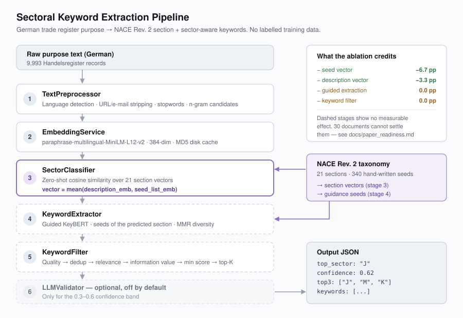

# Sectoral Keyword Extraction Pipeline

[](https://github.com/dilaydikbiyik/keyword-extractor/actions/workflows/ci.yml)
[](LICENSE)
[](https://www.python.org/downloads/)

An unsupervised pipeline that assigns German trade register business purposes to
**NACE Rev. 2** sections and extracts sector-aware keywords, using multilingual
sentence embeddings and taxonomy-guided KeyBERT — no labelled training data.


---

## Results

299 documents sampled from the corpus, 17 NACE sections. Every figure is
produced by `make reproduce` and written to
[`results/metrics.json`](results/metrics.json).

| System | Top-1 | 95% CI | Top-3 | F1-macro | κ | p vs. ours |
| --- | --- | --- | --- | --- | --- | --- |
| Random | 5.7% | [3.0, 8.4] | 14.4% | 0.040 | 0.007 | <0.001 |
| Majority class (oracle floor) | 21.4% | [16.7, 26.1] | 46.5% | 0.021 | 0.000 | 0.002 |
| TF-IDF → nearest NACE section | 25.8% | [21.1, 30.8] | 40.5% | 0.186 | 0.210 | 0.011 |
| Zero-shot embeddings (no taxonomy) | 29.1% | [24.1, 34.4] | 62.2% | 0.239 | 0.240 | 0.023 |
| Unguided KeyBERT | 29.1% | [24.1, 34.4] | 62.2% | 0.239 | 0.240 | 0.023 |
| **Ours: taxonomy-guided** | **34.4%** | [29.1, 39.8] | **66.9%** | **0.276** | **0.296** | — |

`p` is an exact McNemar test against the full system on the same documents.

**Taxonomy guidance beats the description-only baseline by 6.4 points
(p = 0.008) and TF-IDF by 10.0 points (p = 0.004).** Top-3 is 66.9%: the correct
section is among the first three suggestions two times out of three, which is
the number that matters for a system meant to propose a code to a human.

**Two things to know before reading further.** The evaluation labels are
*silver* — produced by a language model applying
[`docs/annotation_guidelines.md`](docs/annotation_guidelines.md). A blind human
pilot over 50 of them agreed 58% of the time (κ = 0.542), with 80% agreement
where the labeller flagged high confidence and 36% where it flagged low; the
disagreements were adjudicated into three written rules and the measurement
pass is still open. And this repository previously reported 80.0% on a
30-document evaluation set that was written by hand rather than sampled from
the corpus; on real register text the same code scores 34.4%. The old number
was not wrong, it was measured on the wrong text.
[`docs/paper_readiness.md`](docs/paper_readiness.md) has the full account.

### Ablation

| Variant | Top-1 | Δ Top-1 | F1-macro | p vs. full |
| --- | --- | --- | --- | --- |
| Full system | 34.4% | — | 0.276 | — |
| − seeds in sector vector | 29.1% | −5.4 pp | 0.239 | 0.023 |
| − description in sector vector | 33.1% | −1.3 pp | 0.282 | 0.704 |
| − seed-guided extraction | 34.4% | 0.0 pp | 0.276 | 1.000 |
| − six-stage keyword filter | 34.4% | 0.0 pp | 0.276 | 1.000 |
| + cleaned text into the classifier | 30.4% | −4.0 pp | 0.264 | 0.155 |
| ↔ mpnet-base-v2 encoder (768-dim) | 33.4% | −1.0 pp | 0.254 | 0.820 |
| ↔ German translated to English first | 40.8% | +6.4 pp | 0.308 | 0.027 |

The last two rows need extra model downloads: `python run.py --extra-ablations`.

- **The seed-keyword vector is the component that carries the result** and the
  only one with a significant effect.
- **Guided extraction and the six-stage filter show no effect**, now on two
  different evaluation sets.
- **Translating to English first is the strongest variant** (+6.4 pp,
  p = 0.027), which weakens any claim that the method depends on German
  representations.
- **Routing cleaned text into the classifier costs 4.0 points here** and
  appeared to gain 6.7 on the old 30-document set — the same code, the opposite
  conclusion. It ships as
  `classification.classify_preprocessed_text`, off by default.

---

## Install

```bash
python3 -m venv .venv && source .venv/bin/activate
pip install -r requirements.txt
python quickstart.py
```

Three commands, no model downloads to arrange by hand and no optional language
models: the encoder is fetched on first use and everything else is pinned.
`make install` does the same and creates `.venv` if it is missing.

Every `make` target uses `.venv` automatically, so they work without activating
it. Bare `python …` commands need `source .venv/bin/activate` first.

## Reproduce every number above

```bash
make reproduce
```

Equivalent to `python run.py --config config/config.yaml`.  Runs the baseline
comparison, the ablation study and the error analysis with a fixed seed, and
writes:

| File | Contents |
| --- | --- |
| `results/metrics.json` | Headline metrics plus every system, with provenance |
| `results/baselines.json`, `results/ablation.json` | Full per-system results |
| `results/tables/*.md` | The markdown tables above |
| `results/error_analysis.csv` | Misclassified documents, ready for manual coding |
| `results/verification_sample.csv` | 50 documents for the human label check |

This works from a clean clone. The raw trade register records are **not**
redistributed, but the vocabulary and IDF weights the TF-IDF baseline needs are
committed under `data/derived/` and reproduce the fitted baseline exactly —
identical section rankings on all 30 documents. See
[`data/README.md`](data/README.md).

---

## Pipeline



Dashed stages are the ones the ablation finds no evidence for.

## Usage

```python
from src.controllers.controller import ExtractionController
from src.services.embedder import EmbeddingService
from src.services.classifier import SectorClassifier
from src.services.extractor import KeywordExtractor
from src.services.filter import KeywordFilter
from src.utils.preprocessing import TextPreprocessor

embedder = EmbeddingService()
controller = ExtractionController(
    embedding_service=embedder,
    classifier=SectorClassifier(embedder),
    extractor=KeywordExtractor(),
    keyword_filter=KeywordFilter(),
    preprocessor=TextPreprocessor(),
)

result = controller.extract(
    "Softwareentwicklung und API-Integration für Cloud-Lösungen.",
    top_n_keywords=10,
)
result["sector_classification"]["top_sector"]      # "J"
[kw["keyword"] for kw in result["keywords"]]       # ['softwareentwicklung', ...]
```

Batch processing, iterative seed expansion and taxonomy editing are documented
in [`docs/PROJECT_SUMMARY.md`](docs/PROJECT_SUMMARY.md).

---

## Data

| Path | In git | What it is |
| --- | --- | --- |
| `data/taxonomy/sectors.json` | yes | 21 NACE sections, 340 hand-written seed keywords |
| `data/evaluation/human_labels.json` | yes | 299 corpus-sampled documents with NACE section labels |
| `data/derived/tfidf_corpus_stats.json` | yes | Vocabulary and IDF weights derived from the corpus |
| `data/raw/handelsregister_sample_10k.csv` | no | 9,993 German trade register purposes |

The corpus is not redistributed; the statistics derived from it are, which is
what makes `make reproduce` work from a clone.
[`data/README.md`](data/README.md) has the reasoning and the evidence that the
substitution is exact.

---

## Repository layout

```
src/                    The shipped pipeline
  controllers/          ExtractionController — 5-step orchestration
  services/             embedder · classifier · extractor · filter · validator
  models/               TaxonomyManager · evaluation metrics
  utils/                TextPreprocessor (DE / TR / EN)
experiments/            Paper-only code, kept out of src/
  systems.py            Baselines and ablations as compositions of components
  metrics.py            Bootstrap CIs and exact McNemar on top of src metrics
  error_analysis.py     Error codebook and automatic flags
  run_experiments.py    Baseline + ablation suites
  run_error_analysis.py Error report and annotation CSV
  build_annotation_queue.py  Stratified sampling for new labels
paper/                  Workshop paper skeleton; tables generated from results/
tools/                  annotate.html (offline labelling) · make_demo_gif.py
results/                Generated — every number cited anywhere
tests/                  128 tests
run.py                  make reproduce
```

## Tests

```bash
make test          # or: pytest tests/ -q
make lint
```

106 tests: 72 covering the pipeline, 34 covering the experiment harness.  One of
them asserts that the harness's "full system" predicts the same section as the
shipped `SectorClassifier`, so the ablation table measures the real pipeline
rather than a lookalike.

## Configuration

All tunables live in [`config/config.yaml`](config/config.yaml) and are read
through `src/utils/config.py`: embedding model and chunking, preprocessing
switches, classification threshold and top-k, extraction mode and MMR
diversity, filter cut-off, logging level.

Keys that change nothing have been removed rather than left as decoration, and
`tests/test_config.py::TestEveryConfigKeyIsHonoured` fails if one creeps back
in. Build the pipeline from a config with `pipeline.build_controller()`.

---

## Related literature

| Method | Source | Role |
| --- | --- | --- |
| KeyBERT | Grootendorst (2020) | Pipeline core |
| YAKE! | Campos et al. (2020), *Information Sciences* | Comparison baseline |
| PatternRank | Schopf et al. (2022), ICPRAM | N-gram candidate strategy |
| PromptRank | Kong et al. (2023), ACL | LLM-based comparison |
| Sentence-BERT | Reimers & Gurevych (2019), EMNLP | Embedding foundation |
| Multilingual SBERT | Reimers & Gurevych (2020), EMNLP | Model selection |

Full review and methodology decisions: [`docs/methodology.md`](docs/methodology.md).

---

## Limitations

- **The labels are model-assisted, not gold.** They were produced by a language
  model applying a written guideline, and the human validation pass is not yet
  done. Any published number has to quote the agreement figure from
  `make verify` alongside it.
- **34.4% is a suggestion tool, not an automatic classifier.** Top-3 at 66.9%
  is the usable figure; top-1 is not accurate enough to assign codes unattended.
- **Section M is where it breaks** — 15.6% recall, and it is the largest class.
  The taxonomy has no vocabulary for the holding and management shells that
  make up 13% of the corpus.
- **One annotator on the validation pass.** No inter-annotator agreement has
  been measured; a second annotator on an overlapping subset is what reviewers
  ask for.
- **Keyword extraction is unevaluated on the current set.** It carries section
  labels only, and the ablation has twice found no measurable contribution from
  the keyword half of the pipeline.
- **German only in practice.** The model is multilingual and the preprocessor
  handles DE/TR/EN, but the corpus, the seeds and the evaluation are German.

## Citation

See [`CITATION.cff`](CITATION.cff).

## License

MIT — see [`LICENSE`](LICENSE).
