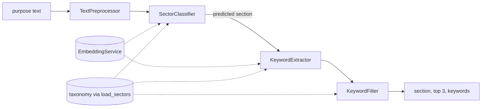
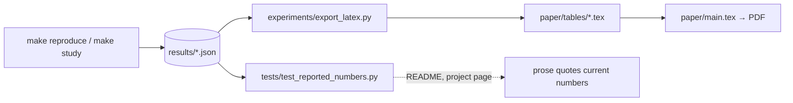

# Architecture

Two things with different lifetimes share this repository: a small library that
assigns NACE sections to German trade register texts (`src/`), and the research
code that measured it (`experiments/`). They are layered so that each depends
only on the layers below it, and the build fails if that stops being true.

## Layers

| Layer | Plays the part of | Code |
| --- | --- | --- |
| Domain model | Model | `src/models/taxonomy.py`: the taxonomy, and `load_sectors`, the one function that reads it from disk |
| Services | Model logic | `src/services/`: embedding, section classification, keyword extraction, keyword filtering |
| Orchestration | Controller | `src/pipeline.py` builds the services from `config/config.yaml`; `src/controllers/controller.py` runs them for each document |
| Entry points and presentation | View | `main.py` (batch), `quickstart.py` (demo) and `run.py` (reproduction); `experiments/report.py`, `experiments/export_latex.py` and `docs/index.html` turn results into something a reader sees |
| Research | Built on top | `experiments/`: baselines and ablations as compositions of the services, metrics, the studies, annotation and submission tooling |

This is MVC's separation of concerns adapted to a research codebase, which has
no interactive view: the "view" is whatever renders a result, whether a command
line summary, a LaTeX table or the project page.

## The rules, and what enforces them

| Rule | Enforced by |
| --- | --- |
| The library never imports the research code | `tests/test_architecture.py` |
| Services never reach up to the controller or the pipeline builder | `tests/test_architecture.py` |
| The domain model depends on nothing above it | `tests/test_architecture.py` |
| Every configuration key is read by some code | `tests/test_config.py::TestNoDeadConfiguration` |
| No number is typed into the paper; each is a macro generated from `results/` | `tests/test_reported_numbers.py` |
| The README and the project page quote the current results | `tests/test_reported_numbers.py` |
| The committed tables are what `results/` produces | CI, `paper` job |
| The paper compiles with no undefined reference, citation or missing glyph | CI, `paper` job |

## One document through the library

1. **Preprocess.** Clean the text and detect its language. The classifier sees
   the raw text by default; `classification.classify_preprocessed_text` switches
   it to the cleaned one, which the paper measures as worse.
2. **Classify.** Cosine similarity between the document embedding and one
   vector per section, built from the section's description (and, in the
   shipped configuration, its seed keywords).
3. **Extract.** KeyBERT, guided by the predicted section's seed keywords.
4. **Filter.** A six-stage keyword filter.

The paper finds that steps 3 and 4 and the seed keywords add no measurable
accuracy. They stay in the library because the paper ablates them, and removing
them would make its ablation table unreproducible.

## From a run to the paper

`make reproduce` regenerates the systems, ablations and error analysis;
`make study` the description studies, the other corpora and the robustness
checks; `make paper` the tables and the PDF. A second run of `make reproduce`
from a clean state reproduces every committed prediction exactly, and records
its own runtime in `results/compute.json`.
